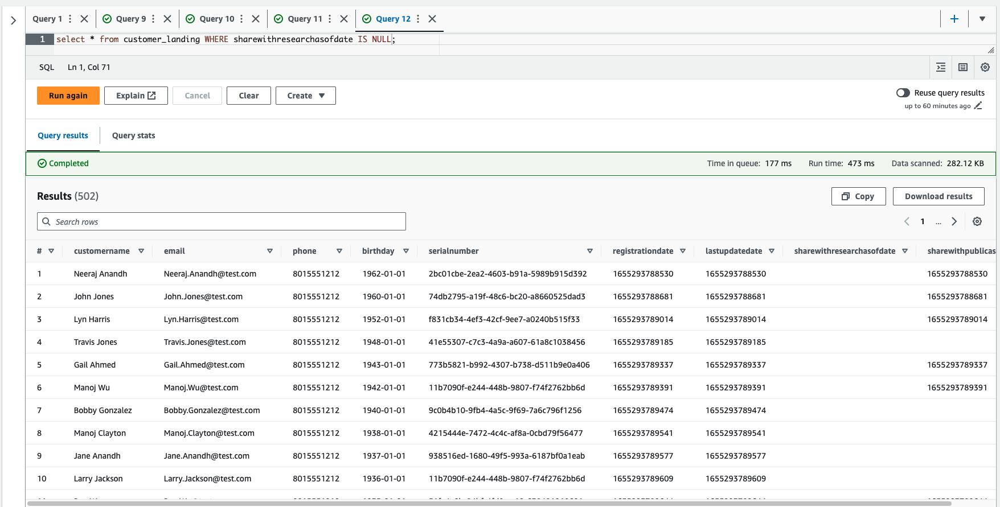
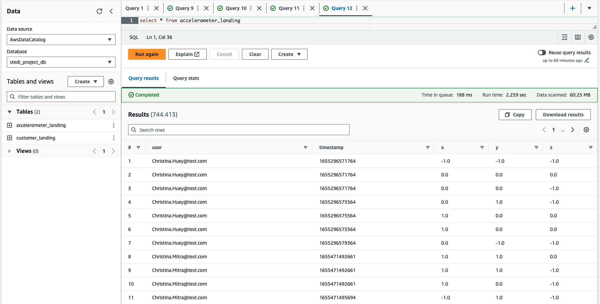

# Project: STEDI Human Balance Analytics

## Project Description

The STEDI Human Balance Analytics project focuses on analyzing human balance data collected from accelerometers. The goal is to process and transform the data into curated insights that can be used for further analysis and research.

## Project Features

- Ingests data from S3 buckets using Glue Studio
- Creates Glue Tables from JSON data using Glue Console
- Queries the Landing Zone using Athena
- Dynamically updates Glue Table schema from JSON data
- Joins Privacy tables with Glue Jobs
- Filters protected PII with Spark in Glue Jobs
- Joins trusted data to create curated data using Glue Jobs

## Project Rubric

For detailed project requirements and grading criteria, please refer to the [Project Rubric](https://review.udacity.com/#!/rubrics/4883/view).

## Data 

Sample Data is provided that needs to be loaded into your own S3 Bucket. Create a "landing zone" folder within the bucket to store the raw data there. The source data looks like this: 

1. Customer Records (from fulfillment and the STEDI website):
    * Columns:
        - serialnumber
        - sharewithpublicasofdate
        - birthday
        - registrationdate
        - sharewithresearchasofdate
        - customername
        - email
        - lastupdatedate
        - phone
        - sharewithfriendsasofdate

2. Step Trainer Records (data from the motion sensor):
    * Columns:
        - sensorReadingTime
        - serialNumber
        - distanceFromObject

3. Accelerometer Records (from the mobile app):
    * Columns:
        - timeStamp
        - user
        - x
        - y
        - z

##  Instructions

Using AWS Glue, AWS S3, Python, and Spark, you will build a lakehouse solution in AWS that satisfies the requirements from the STEDI data scientists. Let's go through each step and understand the expected outcomes.

To simulate the data coming from various sources, you need to create S3 directories for the following landing zones: `customer_landing`, `step_trainer_landing`, and `accelerometer_landing`. Copy the data to these directories as a starting point.

1. **Create Glue Tables for Landing Zones**: Create two Glue tables, one for the `customer_landing` zone and another for the `accelerometer_landing` zone. These tables will allow you to query and analyze the data in a semi-structured format. The expected outcome is to have two Glue tables representing the data in the landing zones.

2. **Query Glue Tables using Athena**: Use Athena to query the Glue tables you created. This will help you understand the data and verify that it has been loaded correctly. 

3. **Sanitize Customer Data**: Sanitize the customer data from the website landing zone and store only the customer records who agreed to share their data for research purposes. Create a Glue table called `customer_trusted` in the trusted zone. The expected outcome is to have a Glue table that contains only the customer records who agreed to share their data.

4. **Sanitize Accelerometer Data**: Similarly, sanitize the accelerometer data from the mobile app landing zone and store only the accelerometer readings from customers who agreed to share their data for research purposes. Create a Glue table called `accelerometer_trusted` in the trusted zone. The expected outcome is to have a Glue table that contains only the accelerometer readings from customers who agreed to share their data.

5. **Sanitize Customer Data for Curated Zone**: Sanitize the customer data from the trusted zone and create a Glue table in the curated zone called `customers_curated`. This table should include customers who have accelerometer data and have agreed to share their data for research.

6. **Populate Step Trainer Trusted Zone**: Read the Step Trainer IoT data stream from S3 and populate a Glue table in the trusted zone called `step_trainer_trusted`. This table should contain the Step Trainer Records data for customers who have accelerometer data and have agreed to share their data for research (customers_curated).

7. **Create Aggregated Table**: Create an aggregated table that combines the Step Trainer Readings with the associated accelerometer reading data for the same timestamp. This table should only include data from customers who have agreed to share their data. Create a Glue table called `machine_learning_curated`. The expected outcome is to have a Glue table that contains the aggregated data for machine learning purposes.

## Data Checks 
This is the result of customer_landing.sql: 
Customer Landing Data</img>

This is the result of accelerometer_landing.sql: 
Accelerometer Landing Data</img>

This is the result of customer_trusted.sql:
Trusted Customer Data</img>

## Use Case Discussion:  Purpose of Different Zones

In this project, we have different zones that serve specific purposes in the data processing pipeline. 

### Landing Zone
The landing zone is where the raw data from various sources is initially stored. It acts as a staging area for data ingestion. In this project, we have three landing zones: `customer_landing`, `step_trainer_landing`, and `accelerometer_landing`. The purpose of the landing zone is to provide a centralized location for storing incoming data before further processing. The business use case is to ensure data availability and readiness for processing.

### Trusted Zone
The trusted zone is where the data is processed and transformed to ensure its quality and reliability. It stores the sanitized and validated data that meets specific criteria. In this project, we have two trusted zones: `customer_trusted`, `accelerometer_trusted` and `step-trainer_trusted`. The purpose of the trusted zone is to store data that has been cleansed and verified, such as customer records who agreed to share their data for research purposes. The business use case is to ensure data integrity and compliance with privacy regulations.

### Curated Zone
The curated zone is a refined and organized version of the data that is suitable for specific use cases or downstream applications. It contains data that has undergone further processing and filtering based on specific criteria. In this project, we have a curated zone called `customers_curated` and the `machine_learning` dataset. The business use case is to provide a clean and structured dataset for analysis, machine learning, or other business intelligence purposes.

By segregating the data into different zones, this architecture enables better data management, data quality control, and efficient processing for various business use cases. It ensures that data is processed and stored in a controlled and meaningful manner, facilitating data-driven decision-making and insights.

