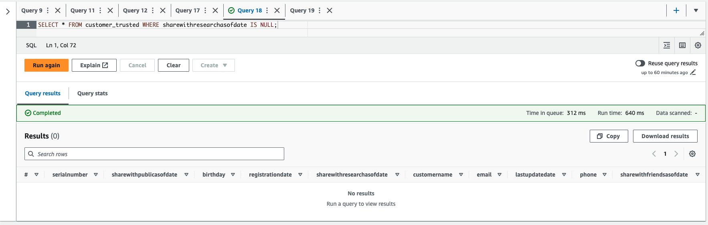

# Project: STEDI Human Balance Analytics

## Project Description

The STEDI Human Balance Analytics project focuses on analyzing human balance data collected from accelerometers. The goal is to process and transform the data into curated insights that can be used for further analysis and research.

## Project Features

- Ingests data from S3 buckets using Glue Studio
- Creates Glue Tables from JSON data using Glue Console
- Queries the Landing Zone using Athena
- Dynamically updates Glue Table schema from JSON data
- Joins Privacy tables with Glue Jobs
- Filters protected PII with Spark in Glue Jobs
- Joins trusted data to create curated data using Glue Jobs

## Project Rubric

For detailed project requirements and grading criteria, please refer to the [Project Rubric](https://review.udacity.com/#!/rubrics/4883/view).

## Data 

Sample Data is provided that needs to be loaded into your own S3 Bucket. Create a "landing zone" folder within the bucket to store the raw data there. The source data looks like this: 

1. Customer Records (from fulfillment and the STEDI website):
    * Columns:
        - serialnumber
        - sharewithpublicasofdate
        - birthday
        - registrationdate
        - sharewithresearchasofdate
        - customername
        - email
        - lastupdatedate
        - phone
        - sharewithfriendsasofdate

2. Step Trainer Records (data from the motion sensor):
    * Columns:
        - sensorReadingTime
        - serialNumber
        - distanceFromObject

3. Accelerometer Records (from the mobile app):
    * Columns:
        - timeStamp
        - user
        - x
        - y
        - z

## Steps 

Once the Data is stored in your S3 you can start processing it and storing it in the respective zones.

### Landing Zone
Start by creating two Glue jobs: <i>customer_landing_to_trusted.py</i> and <i>accelerometer_landing_to_trusted_zone.py</i>.
In each Glue job, add a node that connects to the S3 bucket for the customer and accelerometer landing zones.

### Trusted Zone
Create two SQL DDL scripts: <i>customer_landing.sql</i> and <i>accelerometer_landing.sql<i>.  
Make sure that the SQL DDL scripts include all of the JSON fields in the data input files and are appropriately typed (not everything is a string).
Manually create a Glue Table using the Glue Console from the JSON data.
Use Athena to query the Landing Zone and take a screenshot that shows a select statement from Athena displaying the customer landing data and accelerometer landing data. Ensure that the customer landing data has multiple rows where shareWithResearchAsOfDate is blank.
Trusted Zone (Continued)
Configure Glue Studio to dynamically update a Glue Table schema from JSON data.
Take a screenshot that shows a select * statement from Athena displaying the customer landing data, where the resulting customer trusted data has no rows where shareWithResearchAsOfDate is blank.
Ensure that the Glue jobs have inner joins that join up with the customer_landing table on the serialnumber field.
Make sure that the Glue jobs drop data that doesn’t have data in the sharedWithResearchAsOfDate column.
Curated Zone
Write a Glue Job to join trusted data in the curated zone. Name the Glue job Customer_trusted_to_curated.py and Trainer_trusted_to_curated.py.
Ensure that the curated data from the Glue tables is sanitized and only contains customer data from customer records that agreed to share data. Also, make sure it is joined with the correct accelerometer data.

## Project Instructions

Using AWS Glue, AWS S3, Python, and Spark, you will build a lakehouse solution in AWS that satisfies the requirements from the STEDI data scientists. Let's go through each step and understand the expected outcomes.

To simulate the data coming from various sources, you need to create S3 directories for the following landing zones: `customer_landing`, `step_trainer_landing`, and `accelerometer_landing`. Copy the data to these directories as a starting point.

1. **Create Glue Tables for Landing Zones**: Create two Glue tables, one for the `customer_landing` zone and another for the `accelerometer_landing` zone. These tables will allow you to query and analyze the data in a semi-structured format. The expected outcome is to have two Glue tables representing the data in the landing zones.

2. **Query Glue Tables using Athena**: Use Athena to query the Glue tables you created. This will help you understand the data and verify that it has been loaded correctly. 

3. **Sanitize Customer Data**: Sanitize the customer data from the website landing zone and store only the customer records who agreed to share their data for research purposes. Create a Glue table called `customer_trusted` in the trusted zone. The expected outcome is to have a Glue table that contains only the customer records who agreed to share their data.

4. **Sanitize Accelerometer Data**: Similarly, sanitize the accelerometer data from the mobile app landing zone and store only the accelerometer readings from customers who agreed to share their data for research purposes. Create a Glue table called `accelerometer_trusted` in the trusted zone. The expected outcome is to have a Glue table that contains only the accelerometer readings from customers who agreed to share their data.

5. **Sanitize Customer Data for Curated Zone**: Sanitize the customer data from the trusted zone and create a Glue table in the curated zone called `customers_curated`. This table should include customers who have accelerometer data and have agreed to share their data for research.

6. **Populate Step Trainer Trusted Zone**: Read the Step Trainer IoT data stream from S3 and populate a Glue table in the trusted zone called `step_trainer_trusted`. This table should contain the Step Trainer Records data for customers who have accelerometer data and have agreed to share their data for research (customers_curated).

7. **Create Aggregated Table**: Create an aggregated table that combines the Step Trainer Readings with the associated accelerometer reading data for the same timestamp. This table should only include data from customers who have agreed to share their data. Create a Glue table called `machine_learning_curated`. The expected outcome is to have a Glue table that contains the aggregated data for machine learning purposes.

## Data Checks 
This is the result of customer_landing.sql: 
Customer Landing Data</img>

This is the result of accelerometer_landing.sql: 
Accelerometer Landing Data</img>

This is the result of customer_trusted.sql:
Trusted Customer Data</img>

